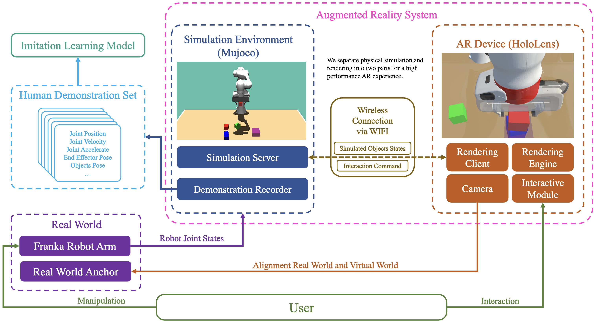

# HDAR (Human Demonstration Augmented Reality)

This repo is the HDAR Unity Client code,
please set up the simulation server from this [repo](https://github.com/intuitive-robots/HDAR-Simulator.git).

The framework graph of this system is following:




## Dependency

This repo is the submodule of [IRXR-Unity](https://github.com/intuitive-robots/IRXR-Unity.git).
To set up the IRXR-Unity, please find the docs.

For the simulation server,
please find the repo and deploy it in the simulation machine.


[Paper Website](https://intuitive-robots.github.io/HDAR-Simulator/)

This application supports our paper ["A Comprehensive User Study on Augmented Reality-Based Data Collection Interfaces for Robot Learning"](https://intuitive-robots.github.io/HDAR-Simulator/), which was published on HRI2024. If you find our work useful, please consider citing.

```latex
@inproceedings{jiang2024comprehensive,
  title={A Comprehensive User Study on Augmented Reality-Based Data Collection Interfaces for Robot Learning},
  author={Jiang, Xinkai and Mattes, Paul and Jia, Xiaogang and Schreiber, Nicolas and Neumann, Gerhard and Lioutikov, Rudolf},
  booktitle={Proceedings of the 2024 ACM/IEEE International Conference on Human-Robot Interaction},
  pages={10},
  year={2024},
  organization={ACM},
  address={Boulder, CO, USA},
  date={March 11--14}
}
```